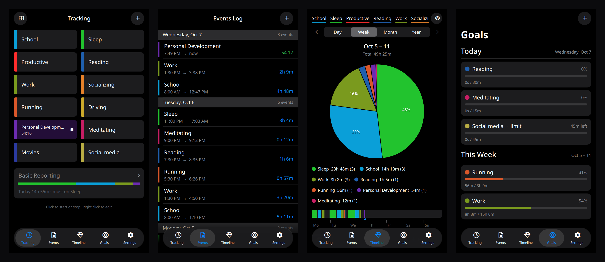
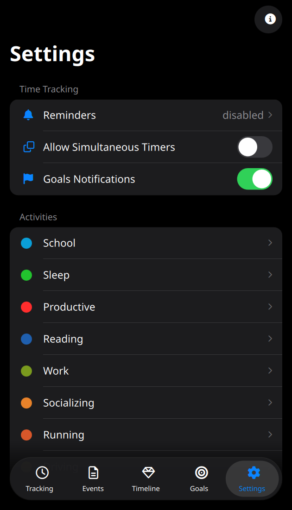
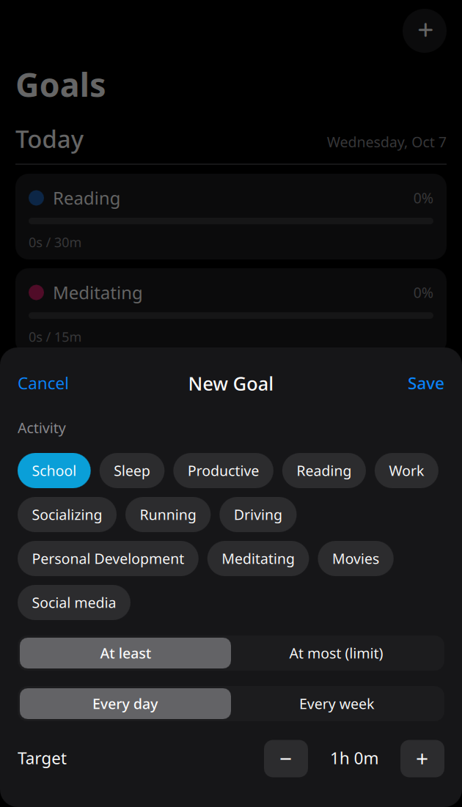

# Time Tracker for Omarchy

A free time tracker for [Omarchy](https://omarchy.org). Click an activity to start its timer, click again to stop. See where your time went by day, week, month or year, and set goals.

No account, no subscription, no network. Everything stays on your machine.

<p align="center">
  
</p>

<p align="center">
  
  &nbsp;
  
</p>

*Screenshots use made-up data.*

## Features

- **Tracking**: your activities as coloured tiles (or a list). Click one to start it; it lights up with a live timer. Click it again to stop. Right click edits it.
- **Events log**: every stretch of time, newest first, grouped by day. Click one to change its times or activity, or delete it. **+** adds one you forgot to track.
- **Timeline**: a pie chart (or bars) for a day, week, month or year, with arrows to go back in time. Underlined names along the top hide or show activities, a strip shows when each stretch happened, and **Export →** saves a CSV.
- **Goals**: daily or weekly targets ("Reading at least 30m a day") and limits ("Social media at most 45m a day"), with progress bars and a notification when you get there.
- **Settings**: several timers at once, a reminder when a timer has run for hours, time format (`4h 12m`, `4:12`, `4.2h`), rounding, start of the week, and an activity manager to rename, recolour, reorder, archive or delete.
- **In the bar**: shows what's running (` Reading 12:03`). Click to open the app, right click to stop.
- Timers are saved as start times, so they keep counting while the window is closed or the computer is off.

## Requirements

- **Omarchy 4** (Hyprland + Quickshell). Built and tested on Omarchy 4.0 with Quickshell 0.3.1 and Qt 6.11.
- `jq`, Noto Sans and a Nerd Font, which Omarchy ships.

## Install

```bash
omarchy plugin add https://github.com/nabdalla-prog/Rimuru-timetracker.git --enable
```

A clock appears in your bar. Click it to open Time Tracker.

**Optional, to open it from the app launcher (Super + Space):** in the app, go to *Settings › Add to App Launcher*, or run:

```bash
~/.config/omarchy/plugins/rimuru.timetracker/install.sh
```

That adds a launcher entry and the `omarchy-timetracker` command. Nothing in your Hyprland or Omarchy config is changed: the window's size and float rule are set at runtime when the app starts.

## Update

```bash
omarchy plugin update
omarchy-timetracker quit     # the next open runs the new version
```

## Remove

```bash
~/.config/omarchy/plugins/rimuru.timetracker/bin/omarchy-timetracker quit
~/.config/omarchy/plugins/rimuru.timetracker/install.sh --uninstall   # only if you ran install.sh
omarchy plugin remove rimuru.timetracker
```

Your data stays in `~/.local/share/omarchy-timetracker/`. Delete that folder too if you want it gone.

## Use

Closing the window hides it. The app keeps running quietly so timer reminders and goal notifications still arrive. `omarchy-timetracker quit` closes it completely.

| Key | Action |
|---|---|
| `1`–`5` | Tracking, Events, Timeline, Goals, Settings |
| `n` | New activity, event or goal (depending on the tab) |
| arrows, `Enter` | Move between tiles and start/stop (Tracking) |
| `s` | Stop every timer |
| `←` `→`, `d` `w` `m` `y` | Page back and forth, pick the period (Timeline) |
| `Esc` | Close a sheet |

From a terminal or a keybinding:

| Command | |
|---|---|
| `omarchy-timetracker` | Open the window (starts the app if needed) |
| `omarchy-timetracker toggle Reading` | Start or stop an activity by name |
| `omarchy-timetracker stop` | Stop every timer |
| `omarchy-timetracker status` | What's running |
| `omarchy-timetracker export` | Write a CSV to `~/Downloads` |
| `omarchy-timetracker --background` | Start hidden (for autostart) |
| `omarchy-timetracker quit` | Close the app |

If you didn't run `install.sh`, the command is at `~/.config/omarchy/plugins/rimuru.timetracker/bin/omarchy-timetracker`.

Example keybinding in `~/.config/hypr/bindings.lua`:

```lua
o.bind("SUPER + SHIFT + T", "Time Tracker", "omarchy-timetracker")
```

## Your data

One JSON file, `~/.local/share/omarchy-timetracker/data.json`: your activities, events, goals and settings. It is written atomically; if it ever can't be read, it is kept as `data.json.corrupt-<time>` and the app starts fresh rather than overwriting it. **Export** writes every event as CSV (`activity,start,end,duration_minutes`) for spreadsheets.

## Troubleshooting

- **The window doesn't float or is the wrong size:** it is set when the app starts. Run `omarchy-timetracker quit`, then open it again.
- **Nothing happens when I click the bar:** run `~/.config/omarchy/plugins/rimuru.timetracker/bin/omarchy-timetracker` in a terminal and check the output.
- **The bar shows an old time:** the bar reads the data file every few seconds; open the app once to refresh it.

## Contributing

Bug reports and pull requests are welcome. See [CONTRIBUTING.md](CONTRIBUTING.md). Logic lives in `js/Model.js` and is tested with `node --test tests/*.test.js`.

## License

[MIT](LICENSE). Free for everyone, forever.
